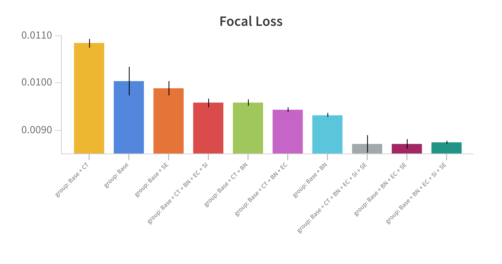

[](https://github.com/MicheleDamian/UNetBox/releases)
[](https://github.com/MicheleDamian/UNetBox/releases)
[](https://github.com/MicheleDamian/UNetBox/releases)

# UNetBox


**UNetBox** is a PyTorch neural network for image segmentation that improves the popular UNet ([arXiv:1505.04597](https://arxiv.org/pdf/1505.04597)) framework. It provides a box of techniques that are commonly used in the computer-vision field, but weren't included in UNet, in the form of plugins that can be easily enabled/disable. As for now, the following are implemented inside UNetBox:

* Sigmoid linear unit (SiLU / Swish) ([arXiv:1710.05941](https://arxiv.org/pdf/1710.05941))
* BatchNorm ([arXiv:1502.03167](https://arxiv.org/pdf/1502.03167))
* Squeeze Excitation layer ([arXiv:1709.01507](https://arxiv.org/pdf/1709.01507))
* Transposed Convolution
* Dimensional Expansion and Compression after downsampling/upsampling

The goal of the project is to add more techniques, as they become available, in order to push the state-of-the-art in image segmentation.


## Ablation Study

In order to explore the influence of the components on UNetBox's performance, I perform ablation studies on two datasets: the [Google's contrails identification dataset](https://www.kaggle.com/competitions/google-research-identify-contrails-reduce-global-warming) and the [Sartorius' cell instance segmentation dataset](https://www.kaggle.com/competitions/sartorius-cell-instance-segmentation).

The training uses the Adam optimizer, mixed precision, and a 1-cycle cosine scheduler to set the learning rate for both datasets. Training run until convergence of the *focal loss* on an out-of-sample dataset (3-fold cross validation).

The tables use the following abbreviations:

* *SI* : SiLU activation units
* *SE* : Squeeze Excitation block added to last activation tensor before downsampling/upsampling
* *EC* : Expansion followed by a Compression of the channels added after downsampling/upsampling
* *BN* : BatchNorm
* *CT* : Convolution Transposed replaces bilinear interpolation for upsampling 


### Google's Contrails Identification Dataset


For this dataset each batch contains 64 3-channels, 256x256-pixels images. UNetBox's model has `depth=4` and `expansion_layer=16`.

| SI | SE | EC | BN | CT | Focal Loss x10<sup>-3</sup> | Standard Error | Training Time (m) | # Parameters |
|:--:|:--:|:--:|:--:|:--:|----------------------------:|---------------:|------------------:|-------------:|
| ✘  | ✘  | ✘  | ✘  | ✘  |                       1.065 |         ± .006 |               242 |            - |
| ✘  | ✘  | ✘  | ✘  | ✔  |                       1.081 |         ± .029 |               195 |    3,032,017 |
| ✘  | ✔  | ✘  | ✘  | ✘  |                        1.08 |         ± .082 |               226 |    3,087,317 |
| ✘  | ✘  | ✘  | ✔  | ✔  |                       1.057 |         ± .008 |               132 |    3,033,937 |
| ✘  | ✘  | ✔  | ✔  | ✔  |                        1.04 |         ± .005 |               163 |    6,063,761 |
| ✔  | ✘  | ✔  | ✔  | ✔  |                       1.022 |         ± .022 |               147 |    6,063,761 |
| ✔  | ✔  | ✔  | ✔  | ✔  |                       1.016 |         ± .014 |               132 |    6,119,061 |

A Jupyter Notebook that runs all the tests in the table is provided at [tests/contrails_ablation_study.ipynb](./tests/contrails_ablation_study.ipynb). You can refer to it as an example to use the package as well. 

### Sartorius' cell instance segmentation dataset


For this dataset each batch contains 16 grayscale, 512x512-pixels images. UNetBox's model has `depth=2` and `expansion_layer=8`.

| SI | SE | EC | BN | CT | Focal Loss x10<sup>-2</sup> | Standard Error | # Parameters |
|:--:|:--:|:--:|:--:|:--:|----------------------------:|---------------:|-------------:|
| ✘  | ✘  | ✘  | ✘  | ✘  |                       1.004 |         ± .053 |       43,353 |
| ✘  | ✘  | ✘  | ✘  | ✔  |                       1.085 |         ± .016 |       43,353 |
| ✘  | ✘  | ✘  | ✔  | ✘  |                      0.9321 |        ± .0690 |       43,545 |
| ✘  | ✔  | ✘  | ✘  | ✘  |                      0.9892 |        ± .0272 |       44,243 |
| ✘  | ✘  | ✘  | ✔  | ✔  |                      0.9593 |        ± .0115 |       43,545 |
| ✘  | ✘  | ✔  | ✔  | ✔  |                      0.9438 |        ± .0915 |       86,393 |
| ✘  | ✔  | ✔  | ✔  | ✘  |                      0.8707 |        ± .0168 |       87,283 |
| ✔  | ✔  | ✔  | ✔  | ✘  |                      0.8745 |        ± .0649 |       87,283 |
| ✔  | ✘  | ✔  | ✔  | ✔  |                       0.958 |        ± .0156 |       86,393 |
| ✔  | ✔  | ✔  | ✔  | ✔  |                      0.8714 |        ± .0316 |       87,283 |



## Dependencies

UNetBox has been tested with the following dependencies:

* Python >= 3.10
* PyTorch >= 2.0
* Torchvision >= 0.15
* Timm >= 0.9

## Usage

UNetBox can be downloaded by the following command:

```bash
git clone https://github.com/MicheleDamian/UNetBox.git $absolute_path_to_repo
```

Make sure that `sys.path` contains the (absolute) path to the repo and import it:

```python
import sys
sys.path.insert(0, f'{absolute_path_to_repo}/UNetBox')

from unetbox.net import UNetBox

model = UNetBox()
```
